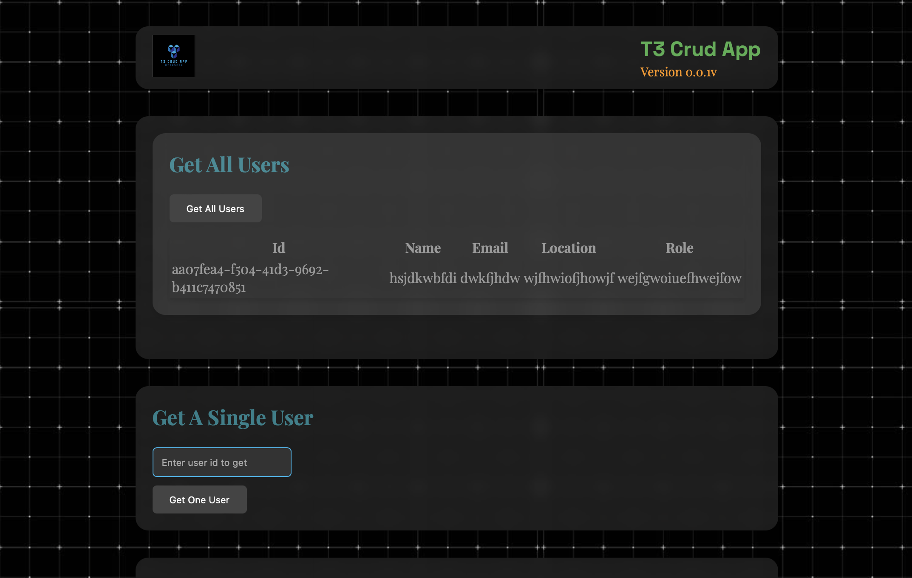

# T3-CRUD-APP



## Table of Contents
- [Introduction](#introduction)
- [Features](#features)
- [Installation](#installation)
- [Usage](#usage)
- [API Endpoints](#api-endpoints)
- [Technologies Used](#technologies-used)
- [License](#license)

## Introduction
T3-CRUD-APP is a full-stack application built with the T3 stack, which includes TypeScript, Tailwind CSS, and TRPC for creating and managing users. The app features user creation, reading, updating, and deletion functionalities.

## Features
- Create new users
- Read all users
- Read individual users
- Update user information
- Delete users

## Installation
Follow the steps below to set up the project locally.

### Prerequisites
- [Node.js](https://nodejs.org/en/download/) (version 14 or later)
- [Yarn](https://classic.yarnpkg.com/en/docs/install) (or npm)

### Clone the Repository
```sh
git clone https://github.com/yourusername/T3-CRUD-APP.git
cd T3-CRUD-APP

Certainly! Here's a comprehensive README file for your project, including installation guides for all packages and a placeholder for an image.

```markdown
# T3-CRUD-APP


## Table of Contents
- [Introduction](#introduction)
- [Features](#features)
- [Installation](#installation)
- [Usage](#usage)
- [API Endpoints](#api-endpoints)
- [Technologies Used](#technologies-used)
- [Contributing](#contributing)
- [License](#license)

## Introduction
T3-CRUD-APP is a full-stack application built with the T3 stack, which includes TypeScript, Tailwind CSS, and TRPC for creating and managing users. The app features user creation, reading, updating, and deletion functionalities.

## Features
- Create new users
- Read all users
- Read individual users
- Update user information
- Delete users

## Installation
Follow the steps below to set up the project locally.

### Prerequisites
- [Node.js](https://nodejs.org/en/download/) (version 14 or later)
- [Yarn](https://classic.yarnpkg.com/en/docs/install) (or npm)

### Clone the Repository
```sh
git clone https://github.com/yourusername/T3-CRUD-APP.git
cd T3-CRUD-APP
```

### Install Dependencies
Install the necessary packages:
```sh
yarn install
# or
npm install
```

### Setup Environment Variables
Create a `.env` file in the root of the project and add the following environment variables:
```plaintext
DATABASE_URL=your_database_url
```
Replace `your_database_url` with the connection string to your database.

### Prisma Setup
Generate the Prisma client:
```sh
yarn prisma generate
# or
npm run prisma generate
```

Run Prisma migrations to set up your database:
```sh
yarn prisma migrate dev --name init
# or
npm run prisma migrate dev --name init
```

### Start the Development Server
Start the local development server:
```sh
yarn dev
# or
npm run dev
```
The app should now be running on [http://localhost:3000](http://localhost:3000).

## Usage
Open your browser and navigate to [http://localhost:3000](http://localhost:3000) to use the application.

## API Endpoints
Here are the main API endpoints available in the application:

- **Get All Users**: `/api/example/getAll`
- **Get User by ID**: `/api/example/getOne`
- **Create User**: `/api/example/createUser`
- **Update User**: `/api/example/updateUser`
- **Delete User**: `/api/example/deleteUser`

## Technologies Used
- [TypeScript](https://www.typescriptlang.org/)
- [Tailwind CSS](https://tailwindcss.com/)
- [TRPC](https://trpc.io/)
- [Prisma](https://www.prisma.io/)
- [React](https://reactjs.org/)
- [Next.js](https://nextjs.org/)


## License
This project is licensed under the MIT License. See the [LICENSE](LICENSE) file for details.
